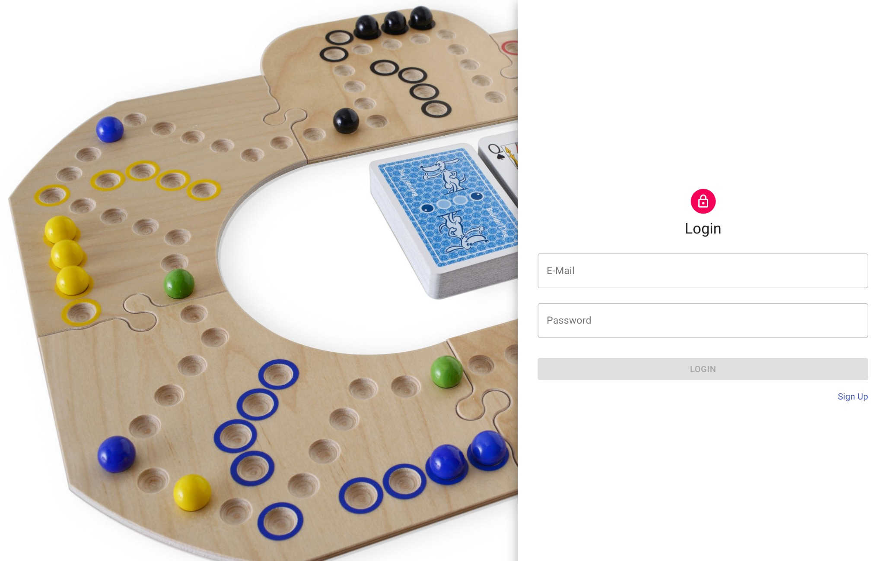
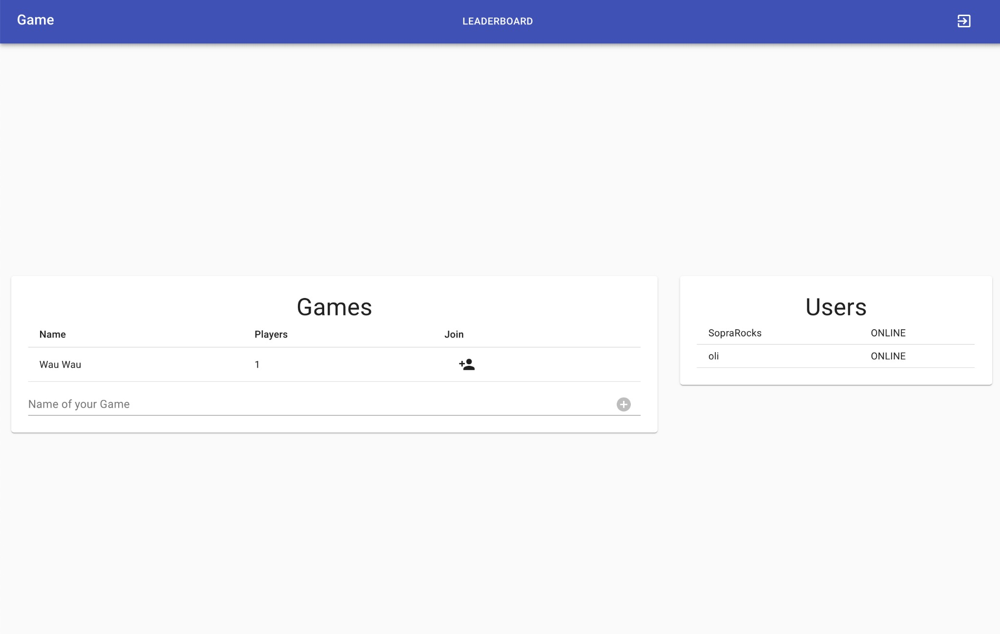
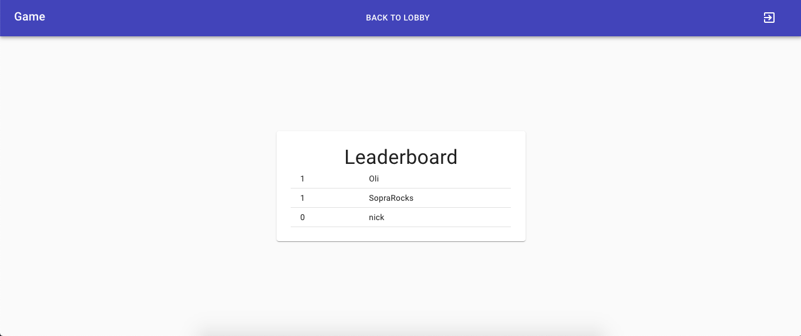
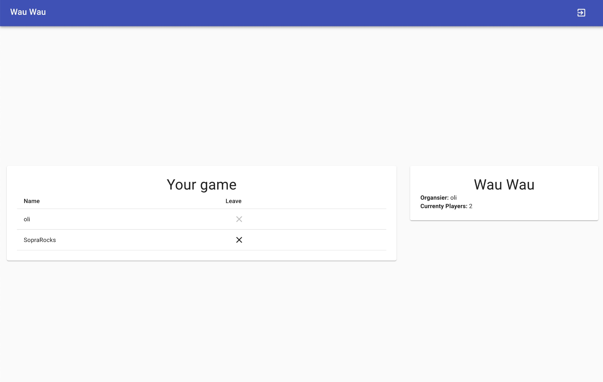
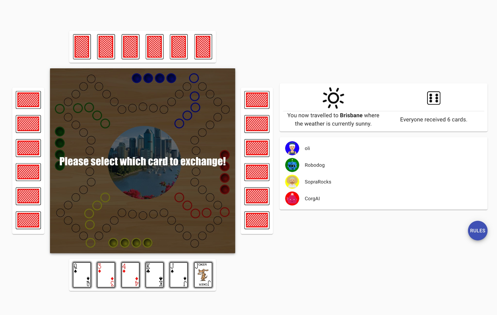
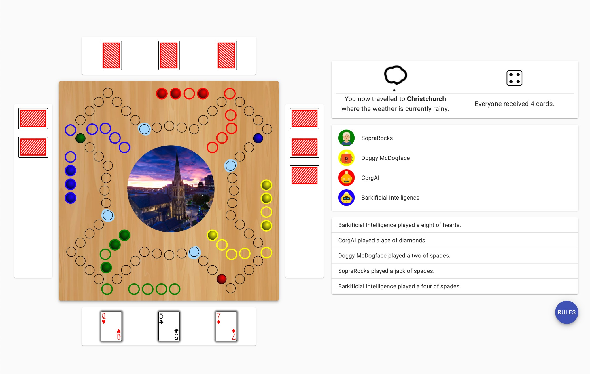
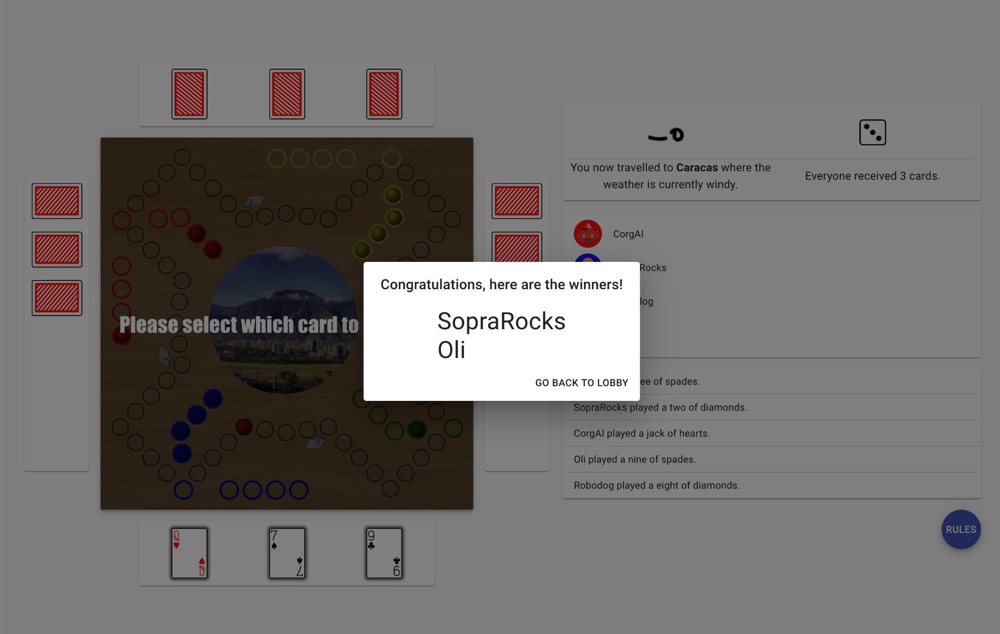

# Brändi Dog around the World

## Introduction

Welcome to Team 08's Brändi Dog around the World application.

The project's aim was to implement a web application based on the popular board game *Brändi dog* but with a online only twist. 

## Technologies
The frontend of the application is based on React. We use the REST-API to exchange data with the backend.

For the interface we largely used the wonderful [Materia UI](https://material-ui.com/) library and some [Styled Components](https://styled-components.com/).

For the password strength inidcation we used the [zxcvbn](https://github.com/dropbox/zxcvbn) by Dropbox. For some pratical javascript utilities we use [lodash](https://lodash.com/).

## High-level components
There are three main components.

### [`Lobby.js`](https://github.com/group-08/client/blob/master/src/components/game/Lobby.js)

This component is the lobby where players land after they logged in. Here they can create or join a Lobby. There is also a list on the side with all users and you can go look at the leaderboard.

### [`GameLobby.js`](https://github.com/group-08/client/blob/master/src/components/game/GameLobby.js)

This is where the players wait for the game to start. New players can join and it is dynamically updated when new players joing (or leave). The host of the game can also start the game for everyone here.

### [`Gameboard.js`](https://github.com/group-08/client/blob/master/src/components/game/Gameboard.js)

The gameboard is where the magic happens.

## Launch & Deployment
For your local development environment you'll need Node.js >= 8.10. You can download it [here](https://nodejs.org). All other dependencies including React get installed with:

### Development

#### `npm install`

This has to be done before starting the application for the first time (only once). And whenever you add a package.

#### `npm run dev`

Runs the app in the development mode.

Open [http://localhost:3000](http://localhost:3000) to view it in the browser.

The page will reload if you make edits.

You will also see any lint errors in the console (use Google Chrome!).

#### `npm run build`

Builds the app for production to the `build` folder.

It correctly bundles React in production mode and optimizes the build for the best performance.

The build is minified and the filenames include the hashes.

Your app is ready to be deployed!

### Deployment

Deployments are automatic on heroku and on Netlify. Netlify also creates a deploy preview which can directly be access from the respective pull requests. Pull requests can only be merged if they pass the deploy on Netlify (`npm run build` needs to work).

## Illustrations

Brändi Dog around the World starts with login mask. If the user has not created an account yet he needs to sign up and log in, the link for the sign up is on the login mask.

After successful login the user gets redirected to the lobby where her can see who else is online and a open a game. There is also a Leaderboard accessible. Other users can join the host in this game, only the host can remove players from the game. The host can start the game at any point, if there are less than four players the remaining slots will be filled with automated bots.

Every time cards are distributed each player needs to select one to swap with his partner. The game is quite intuitive with simply clicking on Cards, Pieces and Fields that get illuminated if they are reachable. There is also a link to the game rules available. The previously mentioned twist of the game is that we visit different places and depending on the weather we have some special fields.

When the game has finished the winners are displayed and the user can go back to the lobby using a link.

## Roadmap

There are some possible contributions new developers could add:
- A six player map could be realized.
- One could add more weather states and more places we can travel to.
- The joker could realize the 7 card.

And the last point might not be that serious:

* A watch mode, where 4 robodogs (bots) play against each other and you can just watch and amuse yourself.

## Authors and acknowledgement
Brändi Dog around the World is a group project of the following five members.

**Oliver Kamer** - *Team Lead and Back-/Frontend* - [olikami](https://github.com/orgs/group-08/people/olikami) 
**Felix Hoffmann** - *Frontend* - [Felixuss](https://github.com/orgs/group-08/people/Felixuss) 
**Nick Kipfer** - *Backend and Frontend* - [GiantDwarf42](https://github.com/orgs/group-08/people/GiantDwarf42) 
**Philip Flury** - *Backend and Frontend* - [TheRobihno70](https://github.com/orgs/group-08/people/TheRobihno70) 
**Flurin Knellwolf** - *Backend* - [saegge123](https://github.com/orgs/group-08/people/saegge123) 
**Alex Scheitlin** - *Support and Advice* - [alexscheitlin](https://github.com/orgs/group-08/people/alexscheitlin) 

We want to thank everybody involved with the Module SoPra and especially Alex Scheitlin, our TA that guided us through the last three months. 

## License

GNU General Public License v3.0 [Full License](LICENSE)
